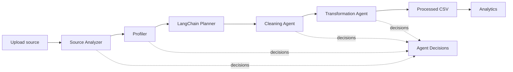

# Orbital: Autonomous Data Engineering Platform

A runnable academic MVP demonstrating adaptive, explainable data engineering with a LangGraph workflow, safe deterministic tools, and optional LangChain-powered llama3.2 planning.

## What works

- Upload CSV, XLSX, JSON, and PDF sources
- Profile rows, columns, nulls, duplicates, numeric ranges, and categorical values
- Generate an adaptive safe-operation plan from observed issues
- Execute the Source Analyzer, Profiler, Planner, Cleaning, and Transformation stages through LangGraph
- Use LangChain `ChatOllama` with `llama3.2` for planning when Ollama is enabled; safely fall back to deterministic planning otherwise
- Execute empty-row/column removal, duplicate removal, numeric and boolean normalization, median/mode imputation, negative-to-zero correction, string normalization, ISO date standardization, snake_case header normalization, detailed validation, and processed CSV storage
- Calculate deterministic quality dimensions and before/after score
- Record agent actions, reasons, tools, timestamps, and status
- React enterprise dashboard with registry, pipeline monitor, quality lift, logs, and analytics query surface
- Demo mode works without an API key or database

## Run locally

```powershell
cd backend
py -3 -m pip install -r requirements.txt
py -3 -m uvicorn app.main:app --reload --port 8001
```

In a second terminal:

```powershell
cd frontend
npm install
npm run dev
```

Open http://localhost:5173. Upload a CSV, choose Pipeline Monitor, and run the autonomous pipeline. The API docs are at http://localhost:8001/docs. Completed agent decisions appear in Agent Decisions.

Use `data/sample_sales_all_tools.csv` to exercise every cleanup operation in one run.

## Optional llama3.2 planner

The default `demo` provider uses the deterministic planner and requires no model service. To use a local Ollama model, install Ollama, pull `llama3.2`, then start the backend with:

```powershell
ollama pull llama3.2
$env:LLM_PROVIDER = "ollama"
$env:LLM_MODEL = "llama3.2"
py -3 -m uvicorn app.main:app --reload --port 8001
```

## Optional PostgreSQL

`docker compose up -d postgres` starts the local PostgreSQL service. The current zero-setup MVP stores runtime metadata in memory and processed files under `backend/data/processed`; the database URL is reserved for the persistence adapter.

## Architecture



## Quality formula

`overall = 0.30 completeness + 0.25 consistency + 0.25 validity + 0.20 uniqueness`.
All dimensions are calculated from Pandas statistics; the planner never invents scores.

## Next integration points

The current pipeline uses an in-memory runtime registry and deterministic data tools. PostgreSQL persistence and grounded PDF retrieval remain optional future extensions; generated code and arbitrary SQL are not executed.

## Tests

```powershell
cd backend
py -3 -m pytest -q
```
