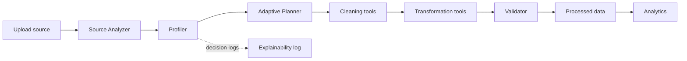

# Orbital: Autonomous Data Engineering Platform

A runnable academic MVP demonstrating adaptive, explainable data engineering with deterministic Python tools and an LLM-ready agent architecture.

## What works

- Upload CSV, XLSX, JSON, and PDF sources
- Profile rows, columns, nulls, duplicates, numeric ranges, and categorical values
- Generate an adaptive safe-operation plan from observed issues
- Execute duplicate removal, median/mode imputation, string normalization, validation, and processed CSV storage
- Calculate deterministic quality dimensions and before/after score
- Record agent actions, reasons, tools, timestamps, and status
- React enterprise dashboard with registry, pipeline monitor, quality lift, logs, and analytics query surface
- Demo mode works without an API key or database

## Run locally

```powershell
cd backend
py -3 -m pip install -r requirements.txt
py -3 -m uvicorn app.main:app --reload
```

In a second terminal:

```powershell
cd frontend
npm install
npm run dev
```

Open http://localhost:5173. Upload a CSV, choose Pipeline Monitor, and run the autonomous pipeline. The API docs are at http://localhost:8000/docs.

## Optional PostgreSQL

`docker compose up -d postgres` starts the local PostgreSQL service. The current zero-setup MVP stores runtime metadata in memory and processed files under `backend/data/processed`; the database URL is reserved for the persistence adapter.

## Architecture



## Quality formula

`overall = 0.30 completeness + 0.25 consistency + 0.25 validity + 0.20 uniqueness`.
All dimensions are calculated from Pandas statistics; the planner never invents scores.

## Next integration points

The modular API surface is ready for SQLAlchemy repositories, a LangGraph state graph, Chroma document chunks with PyMuPDF extraction, and provider adapters selected by `LLM_PROVIDER`. These should be added behind the existing deterministic services rather than allowing generated code or arbitrary SQL to execute.

## Tests

```powershell
cd backend
py -3 -m pytest -q
```
